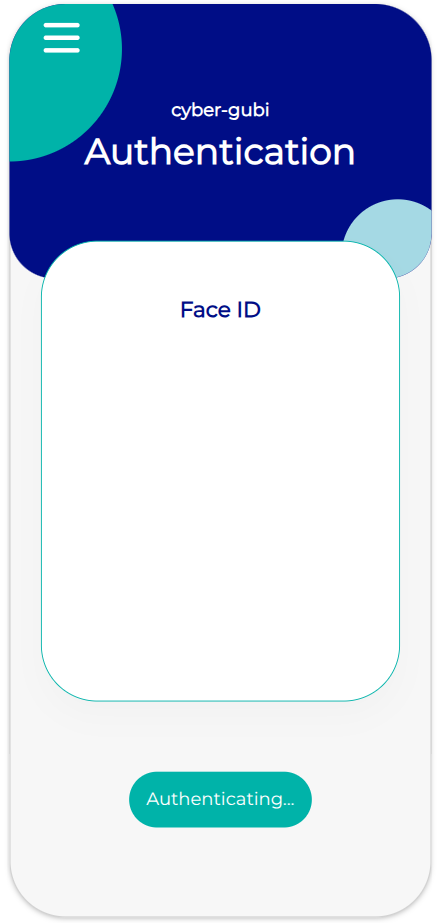
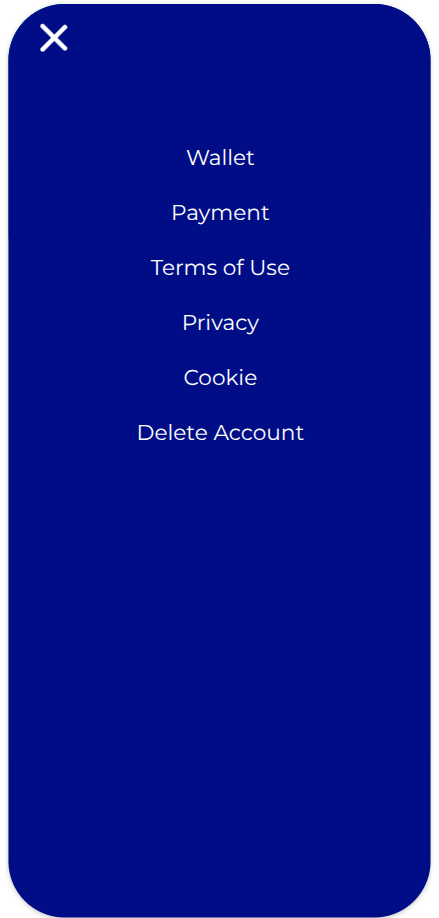
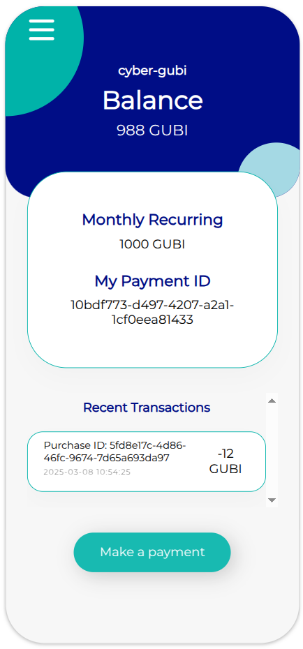
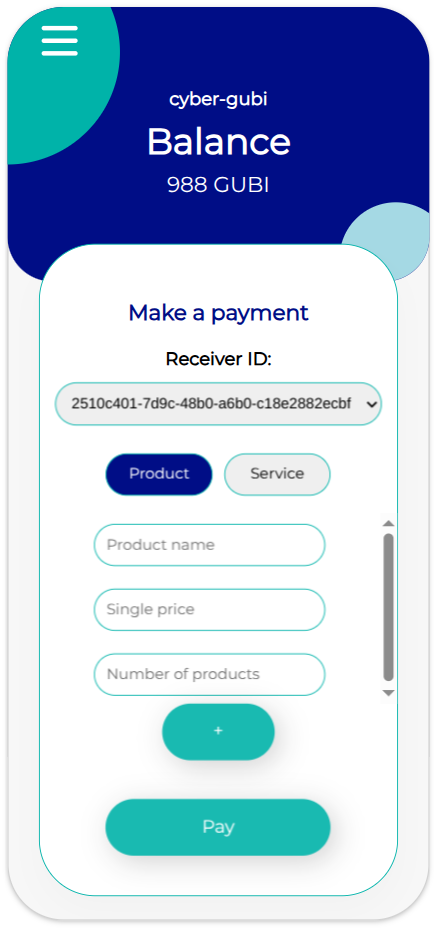
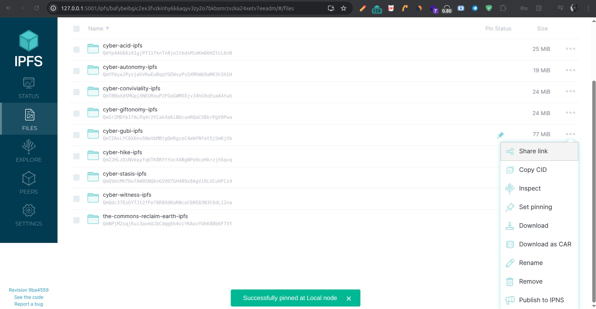
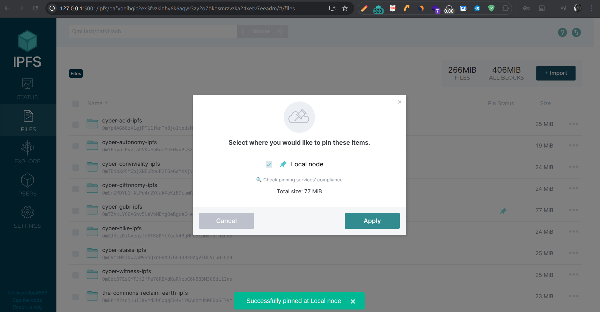

# cyber-gubi - Guaranteed unconditional basic income digital currency

## Screenshots

<a display="inline" href="./assets/authentication.png?raw=true">

</a>
<a display="inline" href="./assets/menu.png?raw=true">

</a>
<a display="inline" href="./assets/wallet.png?raw=true">

</a>
<a display="inline" href="./assets/payment.png?raw=true">

</a>

## Important

+ Cyber-gubi is fully GDPR compliant - the collected biometrics data is encrypted and stored in a public p2p database. The user generates and owns the private keys, account and personal data can be deleted anytime.
+ To receive your basic income you need to login in the span of the last 3 days of each month, see "How to use" for more details

## What is it

+ A guaranteed unconditional basic income global digital currency
+ Natural supply cap - the amount of tokens is limited to the amount of living people receiving them + inflation indexed
+ Natural burn rate - when a beneficiary dies the tokens belonging to that person are out of circulation
+ Inflation indexer - real-time analysis of price fluctuations and adjustment of income

## What it is not

+ Not a crypto currency - not based on blockchain
+ No transfer - tokens can only be used for purchases of products and services
+ No inheritance - tokens can not be inherited
+ No exchange - tokens are not listed on exchanges and can not be traded or speculated with

## How to use

+ Authenticate with your face ID
+ You get redirected to your wallet
+ You can see your payment ID and do payments
+ To pay someone you need their payment ID
+ Each month you will automatically get your basic income debited
+ Important: you can only receive your basic income in the span of the last 3 days of each month
+ This is in order to make sure there are online peers to run the inflation indexer

## Installation

The app runs on the public IPFS network. In order to use it follow the steps below:

1. Install the official IPFS Desktop http://docs.ipfs.io/install/ipfs-desktop/
2. Install IPFS Companion http://docs.ipfs.io/install/ipfs-companion/
3. Install golang 1.20 or later version - https://go.dev/doc/install
4.  Clone https://github.com/stateless-minds/kubo to your local machine
```
git clone https://github.com/stateless-minds/kubo.git
```
5.  Follow the instructions here to open your config file: https://github.com/ipfs/kubo/blob/master/docs/config.md. Usually it's `~/.ipfs/config` on Linux. Add the following snippet to the `HTTPHeaders`:
```{
  "API": {
    "HTTPHeaders": {
      "Access-Control-Allow-Origin": ["webui://-", "http://localhost:3000", "http://k51qzi5uqu5dgw8gbjzw16d1q2rmtkip85yklwk7aknkoc1fkf4qtaxb90ltc7.ipns.localhost:8080", "http://127.0.0.1:5001", "https://webui.ipfs.io"],
      "Access-Control-Allow-Credentials": ["true"],
      "Access-Control-Allow-Methods": ["PUT", "POST"]
    }
  },
 ```
6. Build it and start the daemon:
``` 
cd kubo
export ENC_PASSWORD=your_password_here
make build
./cmd/ipfs/ipfs daemon --enable-pubsub-experiment
```
7.  Navigate to <a href="https://ipfs.io/ipns/k51qzi5uqu5dgw8gbjzw16d1q2rmtkip85yklwk7aknkoc1fkf4qtaxb90ltc7">Cyber Gubi</a>
8.  Pin it to your local node so that you become a permanent host of it while you have IPFS daemon running



## Path to mainstream adoption

+ Map it to your local currency - as a starting point consider cyber-gubi pegged to your local currency with a 1:1 ratio - this is purely for initial pricing reference since it can not be exchanged for other currencies.
+ Spread the word - when you go shopping mention this new currency, how much of it you already have and whether the retailer would accept it. If they express interest tell them to visit cyber-gubi to register in the company waiting list.
+ Once a big enough commercial network registers and wants to use it due to the amount of potential customers having it this creates a push towards nation states to accept it as a form of currency to collect taxes in. They might ask to convert it to local cucrency but cyber-gubi is non-exchangeable so they have to accept it if they want to make money out of it.
+ Wages paid in cyber-gubi are adjusted based on arbitrage between product prices and profit - for example you can sell apples at a rate of 5 to 1 compared to your local currency but pay salaries at a rate of 4 to 1 thus making profit.
+ A free-market economy kicks in and starts regulating internal pricing independently of other currencies - at this point the initial mapping to local currency is no longer needed. The currency starts to live its own life creating own pricing system.
+ The value of cyber-gubi is defined independently by each retailer setting price on own products
+ Subscription based all-in-one businesses emerge as a business model - businesses registered on cyber-gubi appear as list of merchants to all receivers of basic income where you can subscribe for a monthly fee and use what you want
+ All-in-one depots emerge where you pay a monthly fee and use and return instead of own
+ Economy changes from ownership model to usage model
+ Businesses simplify their business models, get predictable profits and reduce costs
+ People no longer need storage

## Simplified
+ Businesses register on the platform in a waitlist
+ When there are enough merchants it goes live
+ A critical mass of businesses means the governments should accept the basic income currency as a valid tax payment method
+ Users get a list of merchants to choose from
+ Users subscribe for a monthly fee and get access to stores
+ Businesses plan accordingly the budget for stocking
+ Businesses save on - pricing, marketing, cashiers, advertising, accounting

## FAQ

+ Why not list it on exchanges and pay taxes in the accepted local currency?
    + It will immediately be speculated with and inflated/deflated.
+ Can I create multiple wallets?
    + No, your account is linked to your face which will get recognized on any new device.
+ What happens with inflation?
    + There is an inflation indexer which tracks price fluctuations in real-time and adjusts the basic income accordingly
+ Why is there no mobile version?
    + App stores are centralized and can take down the app anytime. You can use a mini laptop with Linux instead.
+ How does closing an account influence the economy?
    + Closing an account means all money of the person are destroyed. This will cause deflation as the money supply gets lower.

## TODO

- [x] Add Presentation Attack Detection model to prevent malicious attempts to abuse facial recognition
- [ ] Introduce registration for businesses via waiting list
- [ ] Port go-ipfs-api orbit-db integration to kubo/rpc

## Acknowledgments

1. <a href="https://go-app.dev/">go-app</a>
2. <a href="https://ipfs.io/">IPFS</a>
3. <a href="https://berty.tech/">Berty</a>
4. All the rest of the authors who worked on the dependencies used! Thanks a lot!

## Contributing

<a href="https://github.com/stateless-minds/cyber-gubi/issues">Open an issue</a>

## License

Stateless Minds (c) 2025 and contributors

MIT License

## Credits

+ Modified [Wallet Layout](https://codepen.io/surendharnagarajan/pen/eoKOLL)

Copyright (c) 2025 by Surendhar Nagarajan (https://codepen.io/surendharnagarajan/pen/eoKOLL)

Permission is hereby granted, free of charge, to any person obtaining a copy of this software and associated documentation files (the "Software"), to deal in the Software without restriction, including without limitation the rights to use, copy, modify, merge, publish, distribute, sublicense, and/or sell copies of the Software, and to permit persons to whom the Software is furnished to do so, subject to the following conditions:

The above copyright notice and this permission notice shall be included in all copies or substantial portions of the Software.

THE SOFTWARE IS PROVIDED "AS IS", WITHOUT WARRANTY OF ANY KIND, EXPRESS OR IMPLIED, INCLUDING BUT NOT LIMITED TO THE WARRANTIES OF MERCHANTABILITY, FITNESS FOR A PARTICULAR PURPOSE AND NONINFRINGEMENT. IN NO EVENT SHALL THE AUTHORS OR COPYRIGHT HOLDERS BE LIABLE FOR ANY CLAIM, DAMAGES OR OTHER LIABILITY, WHETHER IN AN ACTION OF CONTRACT, TORT OR OTHERWISE, ARISING FROM, OUT OF OR IN CONNECTION WITH THE SOFTWARE OR THE USE OR OTHER DEALINGS IN THE SOFTWARE.

+ Copyright (c) 2025 by Sanket Bodake 🇮🇳 (https://codepen.io/sanketbodke/pen/qBXBOgb)

Permission is hereby granted, free of charge, to any person obtaining a copy of this software and associated documentation files (the "Software"), to deal in the Software without restriction, including without limitation the rights to use, copy, modify, merge, publish, distribute, sublicense, and/or sell copies of the Software, and to permit persons to whom the Software is furnished to do so, subject to the following conditions:

The above copyright notice and this permission notice shall be included in all copies or substantial portions of the Software.

THE SOFTWARE IS PROVIDED "AS IS", WITHOUT WARRANTY OF ANY KIND, EXPRESS OR IMPLIED, INCLUDING BUT NOT LIMITED TO THE WARRANTIES OF MERCHANTABILITY, FITNESS FOR A PARTICULAR PURPOSE AND NONINFRINGEMENT. IN NO EVENT SHALL THE AUTHORS OR COPYRIGHT HOLDERS BE LIABLE FOR ANY CLAIM, DAMAGES OR OTHER LIABILITY, WHETHER IN AN ACTION OF CONTRACT, TORT OR OTHERWISE, ARISING FROM, OUT OF OR IN CONNECTION WITH THE SOFTWARE OR THE USE OR OTHER DEALINGS IN THE SOFTWARE.